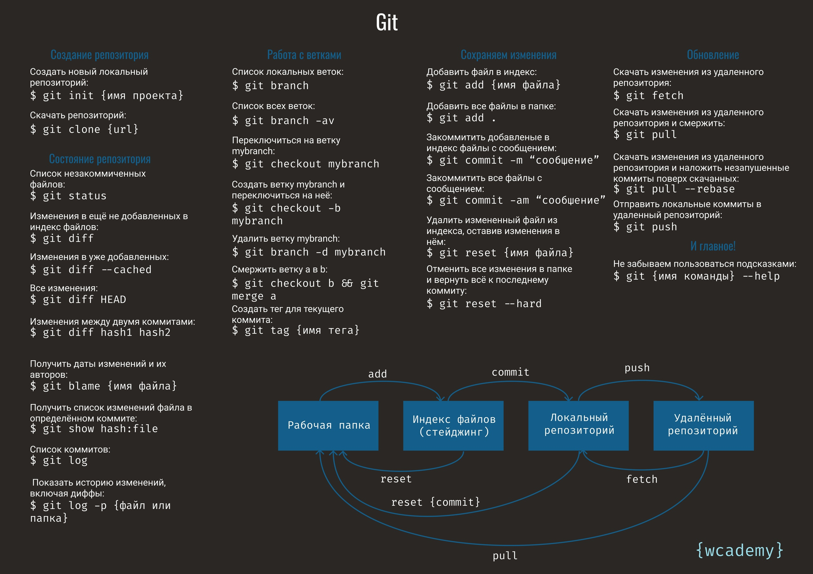

# Инструкция для работы с Mark Downd

## Выделение текста

Чтобы выделить *"Текст"* курсивом, необходимо выделить его звездочками (*) или знаком _нижнего подчеркивания, (_)
Чтобы выделить **"Текст"** полужирным, необходимо выделить его двойными звездочками (**) или знаком _нижнего подчеркивания_, (__)

Альтернативные способы выделения текста жирным или курсивом нужны для того, чтобы мы могли совмещать оба этих способа. Например, _текст может быть выделен курсивом и при этом быть **Полужирным**_

## Работа с изображением

Чтобы вставить изображение, достаточно написать следующее:

## Списки

Чтобы добавить ненумерованные списки, необходимо выделить пункты выделить звездочкой вначале(*)
* Один
* Два
* Три
Чтобы добавить нумерованные списки, достаточно просто пронумеровать через точку:
1. One
2. Two
3. Three

## Ссылки

## Цитаты

## Заключение
Все нормально!